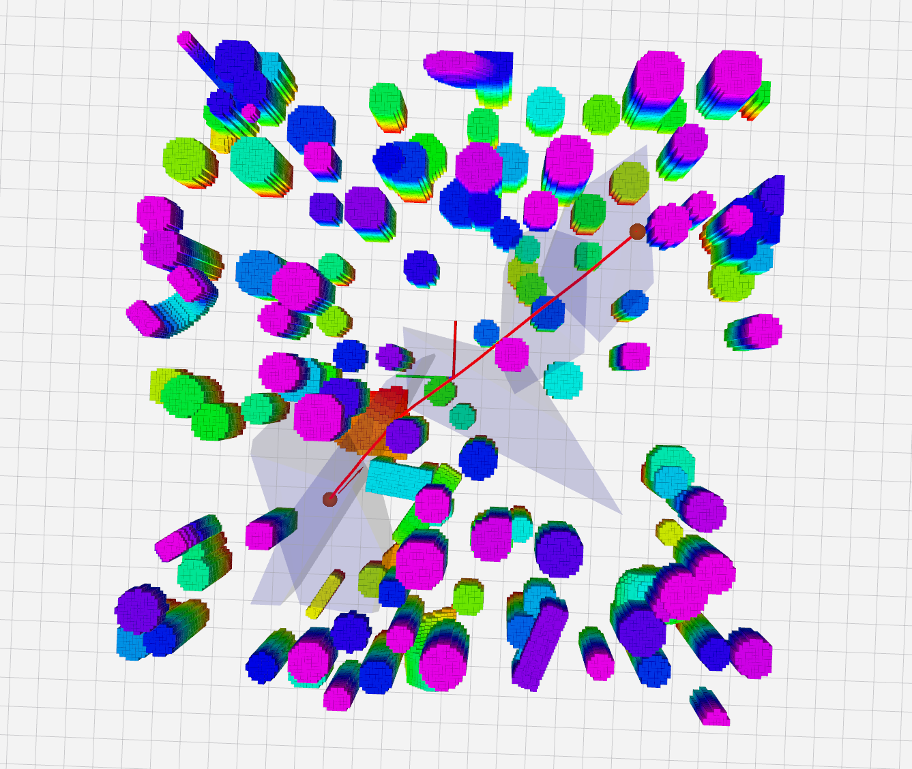
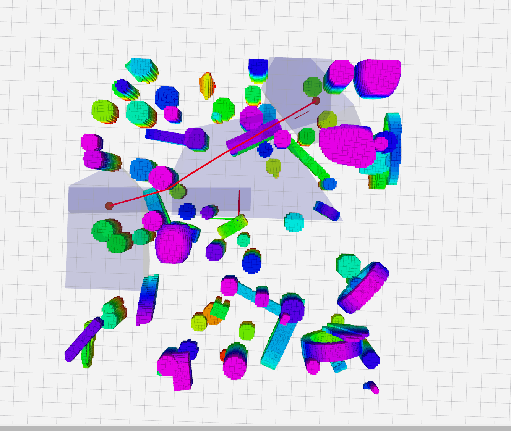
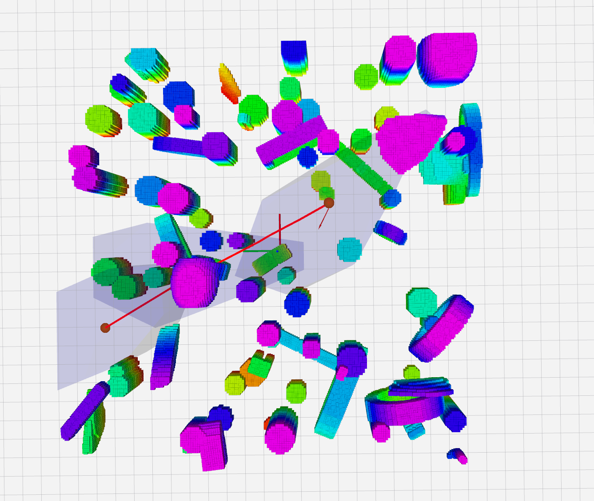
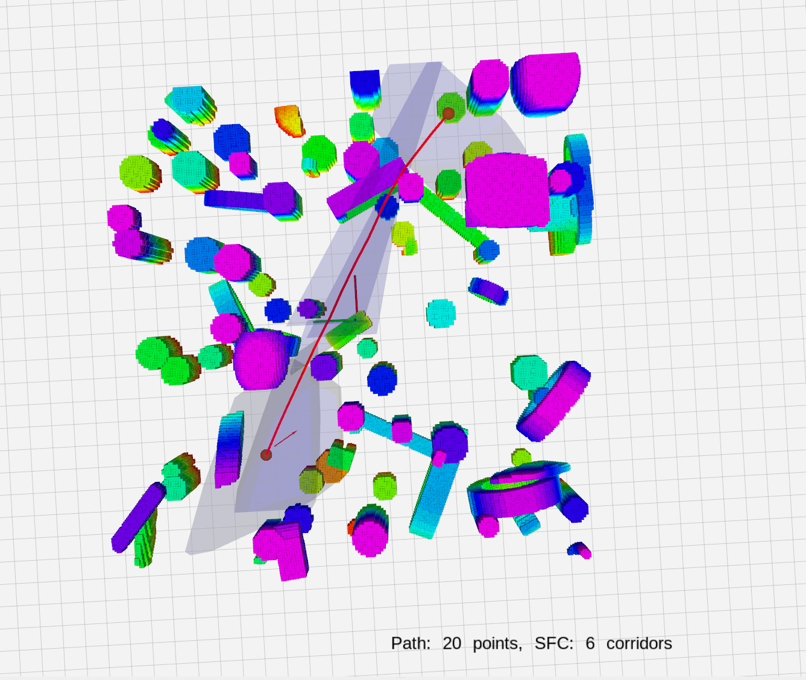

# Simple Path Planner with Safe Flight Corridor Generation

This mini-project focuses on **way-point based initial path generation** and **safe flight corridor generation**. The implementation provides a pipeline from structured map generation to safe corridor-based path planning with real-time visualization.

## Important Acknowledgments

> **Note**: The project is **heavily based** on reference implementation codes from: 
**[Allocnet](https://github.com/KumarRobotics/AllocNet)**
 with modifications mainly focused on pruning the planner part in src/planner/src/learning_planning.

Also, we refer to several amazing open-source projects:

1. [GCOPTER](https://github.com/ZJU-FAST-Lab/GCOPTER) for FIRI(fast iterative region inflation) corridor generation parts
2. [DecompROS](https://github.com/sikang/DecompROS) for refering RILS (regional
inflation by line search algorithm) corridor generation 
3. [kr_param_map](https://github.com/KumarRobotics/kr_param_map) for custom structured map generation in project

## Features in this mini project
1. Map Generation: Creates structured maps using kr_param_map
2. Path Planning: Plans optimal waypoint-based paths using OMPL's informed RRT* algorithm
3. Generates Safe Flight Corridors to ensure collision-free paths using method proposed in [GCOPTER](https://github.com/ZJU-FAST-Lab/GCOPTER)
4. Visualizes the planned paths and safety corridors in RViz

Following is the screenshot result of this mini-project, based on informed RRT* + FIRI SFC generation. *We alao tried to implement the [RILS (DecompROS)](https://github.com/sikang/DecompROS) version's SFC which was used for practice and fun (not finished).* Some result screenshots are shown below:

  
  
  
  

*From left to right: We randomly select several targets and generate 3D SFCs and paths(red lines)*

Not implemented
- Trajectory optimization (time allocation... etc.)
- Control implementation
- .....
